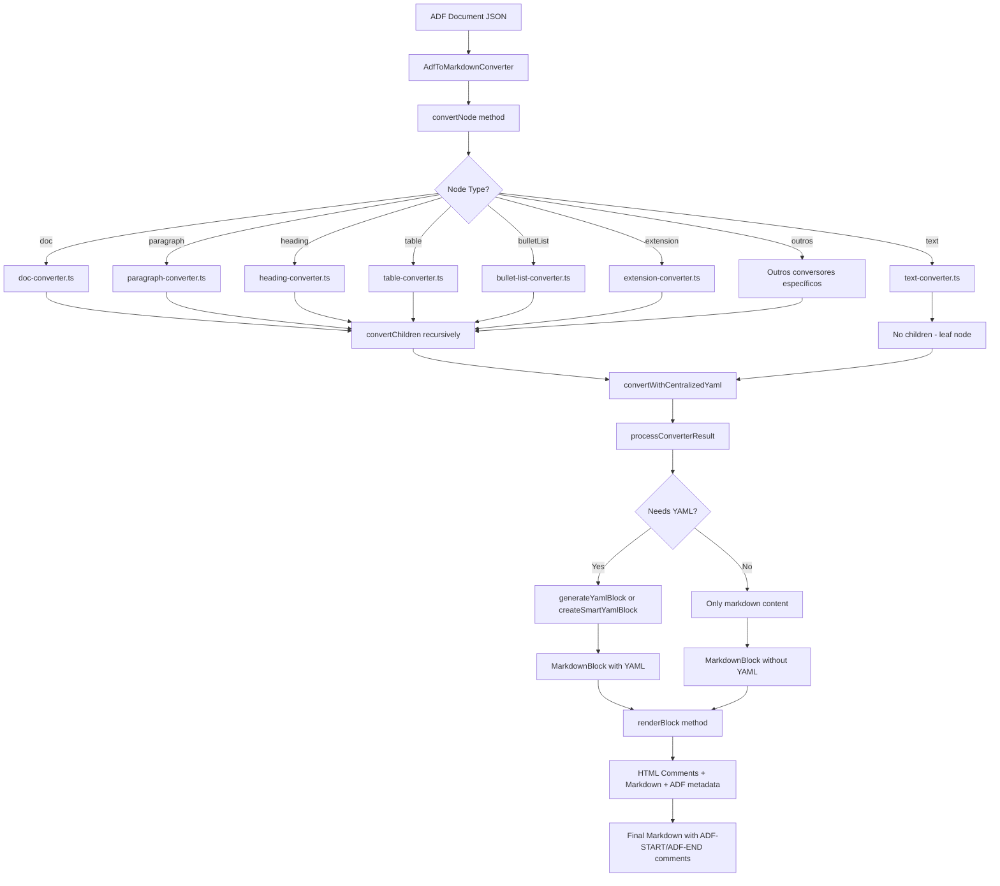

# 🔄 Confluence ↔ Markdown Conversion Flow Documentation

## Overview

This document provides a comprehensive guide for bidirectional conversion between Confluence Storage Format and Markdown, covering both technical implementation details and usage instructions for the Confluence Smart Publisher extension.

## Table of Contents

1. [Confluence to Markdown Conversion](#confluence-to-markdown-conversion)
2. [Markdown to Confluence Conversion](#markdown-to-confluence-conversion)
3. [Supported Elements](#supported-elements)
4. [Technical Implementation](#technical-implementation)
5. [Usage Instructions](#usage-instructions)
6. [Limitations and Considerations](#limitations-and-considerations)

---

## Confluence to Markdown Conversion

### Process Overview

The Confluence to Markdown converter transforms Confluence Storage Format files (`.confluence`) into Markdown format (`.md`), preserving document structure and formatting through a sophisticated ADF (Atlassian Document Format) to Markdown conversion process.

### Conversion Flow

1. **Document Analysis**
   - Read Confluence Storage Format file
   - Parse ADF (Atlassian Document Format) structure
   - Extract metadata from `<csp:parameters>` blocks
   - Identify document elements and hierarchy

2. **Element Processing**
   - Process each ADF node recursively
   - Apply type-specific converters for each element
   - Maintain hierarchical relationships
   - Generate unique IDs for internal links

3. **Markdown Generation**
   - Create YAML front matter from metadata
   - Apply Markdown formatting rules
   - Generate table of contents automatically
   - Validate output syntax

4. **File Output**
   - Save converted content as `.md` file
   - Preserve original file
   - Maintain directory structure

---

## Markdown to Confluence Conversion

### Process Overview

The Markdown to Confluence converter transforms Markdown files (`.md`) into Confluence Storage Format, enabling easy migration and publishing to Confluence.

### Conversion Flow

1. **Initial Validation**
   - Verify file has `.md` extension
   - Check file accessibility and permissions

2. **File Reading and Parsing**
   - Read Markdown content
   - Parse YAML front matter (if present)
   - Analyze document structure

3. **Markdown Parsing**
   - Identify and categorize elements:
     - Headers and their levels
     - Lists (ordered and unordered)
     - Code blocks with language specification
     - Tables with alignment
     - Links and images
     - Text formatting (bold, italic, strikethrough)
     - Blockquotes and special blocks

4. **Confluence Format Conversion**
   - Convert each Markdown element to Confluence Storage Format equivalent
   - Maintain document structure and hierarchy
   - Preserve formatting and styling attributes
   - Generate appropriate ADF nodes

5. **File Creation**
   - Create new `.confluence` file with same base name
   - Write converted content with proper XML structure
   - Add CSP metadata blocks
   - Preserve original Markdown file

6. **User Feedback**
   - Display success message with file path
   - Show error messages for failed conversions
   - Log detailed information to "Output | CSP" panel

---

## Supported Elements

### 1. Metadata Handling

**YAML Front Matter:**
```yaml
---
file_id: "123456"
labels: ["user-story", "scope", "pending"]
version: "1.0"
status: "current"
lastModified: "2025-06-09"
properties:
  author: "John Doe"
  department: "Engineering"
---
```

### 2. Headers

Converts between Confluence headers and Markdown format:

```markdown
# H1 Title
## H2 Title
### H3 Title
#### H4 Title
##### H5 Title
###### H6 Title
```

### 3. Tables

**Markdown Format:**
```markdown
| Header 1 | Header 2 | Header 3 |
|----------|:--------:|---------:|
| Left     | Center   | Right    |
| Cell 1   | Cell 2   | Cell 3   |
```

**Features:**
- Column alignment preservation
- Header detection and formatting
- Property table support (key-value pairs)
- Complex cell content handling

### 4. Lists

**Unordered Lists:**
```markdown
- Item 1
  - Subitem 1.1
  - Subitem 1.2
- Item 2
```

**Ordered Lists:**
```markdown
1. First item
2. Second item
   1. Nested item 1
   2. Nested item 2
3. Third item
```

**Task Lists:**
```markdown
- [x] Completed task
- [ ] Incomplete task
- [x] Another completed task
```

### 5. Code Blocks

**Inline Code:**
```markdown
Use `console.log()` for debugging
```

**Code Blocks:**
```markdown
```typescript
const code = "example";
function hello() {
  return "world";
}
```
```

### 6. Info Blocks and Panels

| Confluence Macro | Markdown Output |
|-----------------|----------------|
| `ac:name="info"` | `> ℹ️ **Info**: Text` |
| `ac:name="tip"` | `> 💡 **Tip**: Text` |
| `ac:name="note"` | `> 📝 **Note**: Text` |
| `ac:name="warning"` | `> ⚠️ **Warning**: Text` |
| `ac:name="error"` | `> ⛔ **Error**: Text` |

### 7. Expandable Sections

```markdown
<details>
<summary>Expandable Title</summary>

Content inside the expandable section
</details>
```

### 8. Links and References

**Internal Links:**
```markdown
[Section Reference](#section-id)
```

**External Links:**
```markdown
[External Link](https://example.com)
```

**Link Resolution:**
- Automatic slug generation for headings
- Confluence page link conversion
- URL validation and correction

### 9. Mathematical Expressions

**Inline Math:**
```markdown
The formula is \(E = mc^2\)
```

**Block Math:**
```markdown
$$
\frac{-b \pm \sqrt{b^2 - 4ac}}{2a}
$$
```

### 10. Special Elements

**Horizontal Rules:**
```markdown
---
```

**Mentions:**
```markdown
@username
```

**Emojis:**
```markdown
:smile: :heart: :thumbsup:
```

---

## Technical Implementation

### Core Architecture

The conversion system uses a modular architecture with specialized converters:

```typescript
interface ConverterResult {
  markdown: string;
  context?: {
    hasComplexContent?: boolean;
    originalType?: string;
    needsYaml?: boolean;
  };
}

class AdfToMarkdownConverter {
  convertNode(node: AdfNode, level: number): Promise<MarkdownBlock>
  convertChildren(node: AdfNode, level: number): Promise<MarkdownBlock[]>
  getConverter(type: string): ConverterFunction
}
```

### Detailed Code Flow: ADF to Markdown Conversion

The ADF to Markdown conversion follows a sophisticated recursive processing pattern. Here's the detailed flow through the codebase:



#### 1. Entry Point: `AdfToMarkdownConverter`
**File:** `src/adf-md-converter/adf-to-md-converter.ts`

This is the main orchestrator class that implements a **Visitor Pattern** to traverse the ADF tree:

```typescript
export class AdfToMarkdownConverter {
  private rootDocument?: AdfNode;
  private allNodes: AdfNode[] = [];
  
  async convertNode(node: AdfNode, level: number = 0): Promise<MarkdownBlock>
  async convertChildren(node: AdfNode, level: number = 0): Promise<MarkdownBlock[]>
  getConverter(type: string): ConverterFunction
}
```

**Why this file exists:**
- Centralize conversion logic in a single class
- Implement controlled recursive processing
- Separate YAML generation responsibility from specific converters
- Provide document-wide context for converters that need it

#### 2. Processing Flow: `convertNode()` and `convertChildren()`

The conversion process follows this sequence:

1. **`convertNode()`** is called for each ADF node
2. **First step:** Call `convertChildren()` to process child nodes recursively (bottom-up approach)
3. **Second step:** Select appropriate converter using `getConverter()`
4. **Third step:** Apply `convertWithCentralizedYaml()` to generate final result

```typescript
async convertNode(node: AdfNode, level: number = 0): Promise<MarkdownBlock> {
  // If root document, collect all nodes for context
  if (node.type === 'doc' && !this.rootDocument) {
    this.rootDocument = node;
    this.collectAllNodes(node);
  }
  
  // Process children first (bottom-up)
  const children = await this.convertChildren(node, level);
  
  // Get specific converter for this node type
  const converter = this.getConverter(node.type);
  
  // Apply converter with centralized YAML generation
  const block = await this.convertWithCentralizedYaml(node, converter, children, level);
  
  return block;
}
```

**Why this approach:**
- **Bottom-up processing:** Children are converted before parents, ensuring proper data flow
- **Context preservation:** Document structure is maintained throughout conversion
- **Centralized control:** All conversions go through the same pipeline

#### 3. Converter Selection: `getConverter()`

This method implements a **Factory Pattern**, mapping ADF node types to specific converters:

```typescript
getConverter(type: string): ConverterFunction {
  if (type === 'paragraph') return convertParagraph;
  if (type === 'heading') return convertHeading;
  if (type === 'table') return convertTable;
  if (type === 'bulletList') return convertBulletList;
  // ... 25+ other mappings
  
  // Fallback for unimplemented types
  return (node, children) => ({
    yamlBlock: generateYamlBlock({ adfType: 'not-implemented', originalNode: node }),
    markdown: ''
  });
}
```

**Why this design:**
- **Extensibility:** Easy to add new node types
- **Maintainability:** Each converter has single responsibility
- **Testability:** Converters can be tested independently
- **Fallback handling:** Unknown types are handled gracefully

#### 4. Specialized Converters
**Directory:** `src/adf-md-converter/converters/`

Each converter handles one specific ADF node type. Examples:

**`paragraph-converter.ts`:**
```typescript
export default function convertParagraph(node: AdfNode, children: MarkdownBlock[]): ConverterResult {
  const markdown = children.map(child => child.markdown).join('');
  return { markdown };
}
```

**`heading-converter.ts`:**
```typescript
export default function convertHeading(node: AdfNode, children: MarkdownBlock[]): ConverterResult {
  const level = node.attrs?.level || 1;
  const text = children.map(child => child.markdown).join('');
  const markdown = `${'#'.repeat(level)} ${text}`;
  return { markdown };
}
```

**`table-converter.ts`:** (More complex)
```typescript
export default function convertTable(node: AdfNode, children: MarkdownBlock[]): ConverterResult {
  // Property Table: special handling for key-value tables
  if (isPropertyTable(node)) {
    // Convert to definition list format
    let markdown = '\n';
    for (const row of children) {
      const cells = row.markdown.split('|').filter(Boolean);
      if (cells.length === 2) {
        markdown += `**${cleanPropertyKey(cells[0])}:** ${cells[1]}\n\n`;
      }
    }
    return { markdown, context: { hasComplexContent: true } };
  }
  
  // Normal Table: standard markdown table format
  // ... different logic for standard tables
}
```

**Why separate converter files:**
- **Single Responsibility Principle:** Each file handles one node type
- **Maintainability:** Changes to one type don't affect others
- **Code organization:** Easy to locate and modify specific conversion logic
- **Team collaboration:** Multiple developers can work on different converters

#### 5. Centralized YAML Generation
**File:** `src/adf-md-converter/utils.ts`

The system uses intelligent YAML generation based on reversibility needs:

```typescript
/**
 * Types that always need YAML blocks for reversibility
 */
const ALWAYS_NEEDS_YAML = new Set([
  'extension', 'bodiedExtension', 'blockCard', 'inlineCard', 'embedCard', 'toc'
]);

/**
 * Critical attributes by node type
 */
const CRITICAL_ATTRIBUTES: Record<string, string[]> = {
  table: ['width', 'layout'],
  tableCell: ['colspan', 'rowspan', 'background'],
  panel: ['panelType', 'panelColor'],
  // ...
};
```

Two YAML generation strategies:

1. **`generateYamlBlock()`:** Always generates YAML
2. **`createSmartYamlBlock()`:** Generates YAML only when needed for reversibility

**Why centralized YAML generation:**
- **Consistency:** Same logic applied across all converters
- **Reversibility:** Ensures ADF → MD → ADF preserves data
- **Performance:** Avoids duplicate logic in each converter
- **Maintainability:** YAML rules managed in one place

#### 6. Result Processing: `processConverterResult()`

This method bridges the gap between converter outputs and final blocks:

```typescript
private processConverterResult(node: AdfNode, result: MarkdownBlock | ConverterResult): MarkdownBlock {
  // Handle legacy MarkdownBlock format
  if ('yamlBlock' in result) {
    return result as MarkdownBlock;
  }
  
  // Process new ConverterResult format
  const converterResult = result as ConverterResult;
  const context = converterResult.context || {};
  
  // Generate YAML based on smart logic or force generation
  const yamlBlock = context.needsYaml 
    ? generateYamlBlock({ adfType: node.type, ...node.attrs })
    : createSmartYamlBlock(node, context);
    
  return {
    yamlBlock,
    markdown: converterResult.markdown,
    adfInfo: { adfType: node.type, localId: node.attrs?.localId || '' }
  };
}
```

#### 7. Final Rendering: `renderBlock()`

Converts `MarkdownBlock` to final string output with ADF metadata:

```typescript
private renderBlock(block: MarkdownBlock): string {
  const { yamlBlock, markdown, adfInfo } = block;
  
  if (!yamlBlock) {
    return markdown; // Simple elements without metadata
  }
  
  // Extract localId for consistency
  const localIdMatch = yamlBlock.match(/localId="([^"]+)"/);
  const localId = localIdMatch?.[1] || adfInfo?.localId || '';
  
  const endComment = `<!-- ADF-END adfType="${adfInfo?.adfType}" localId="${localId}" -->`;
  
  return [yamlBlock, markdown, endComment].filter(Boolean).join('\n');
}
```

**Final output format:**
```markdown
<!-- ADF-START adfType="table" localId="abc123" -->
<!-- YAML
layout: default
width: 760
-->
| Header 1 | Header 2 |
|----------|----------|
| Cell 1   | Cell 2   |
<!-- ADF-END adfType="table" localId="abc123" -->
```

#### 8. Document Context: `DocumentContext`
**File:** `src/adf-md-converter/types.ts`

For converters that need access to the entire document (like TOC):

```typescript
interface DocumentContext {
  allNodes: AdfNode[];
  rootDocument: AdfNode;
}
```

Used by complex converters like `toc-converter.ts` to analyze all headings in the document.

### Converter Architecture Patterns

The system implements 6 distinct converter patterns:

1. **Simple Converters** - Basic synchronous conversion
2. **Async Converters** - For elements requiring external data
3. **Level-Aware Converters** - For nested elements (lists)
4. **Context-Aware Converters** - For document-wide analysis (TOC)
5. **Delegating Converters** - Route to specialized sub-converters
6. **Specialized Logic Converters** - Multiple conversion paths within same converter

### YAML Generation Strategy

The system uses centralized YAML generation with smart detection:

- **Always Generate YAML:** Extensions, cards, complex elements
- **Conditional YAML:** Based on critical attributes for reversibility
- **No YAML:** Simple elements that can be inferred from Markdown

### Error Handling

```typescript
interface ConversionError {
  type: 'warning' | 'error';
  element: string;
  message: string;
  context?: any;
}
```

This architecture ensures that the conversion is **reversible**, **extensible**, and **maintainable**, allowing Confluence documents to be converted to Markdown and back without losing structural information.

---

## Usage Instructions

### Converting Confluence to Markdown

1. **Via Context Menu:**
   - Right-click on a `.confluence` file in VS Code explorer
   - Select "Confluence Smart Publisher" → "Convert to Markdown"

2. **Via Command Palette:**
   - Press `Ctrl+Shift+P` (Windows/Linux) or `Cmd+Shift+P` (Mac)
   - Type "Convert to Markdown"
   - Select the command

### Converting Markdown to Confluence

1. **Via Context Menu:**
   - Right-click on a `.md` file in VS Code explorer
   - Select "Confluence Smart Publisher" → "Convert to Confluence Format"

2. **Command ID:** `confluence-smart-publisher.convertMarkdown`

### Output Files

- **Confluence to Markdown:** Creates `filename.md` alongside `filename.confluence`
- **Markdown to Confluence:** Creates `filename.confluence` alongside `filename.md`
- Original files are never modified or deleted

---

## Limitations and Considerations

### Known Limitations

1. **Complex Formatting**
   - Some Confluence-specific elements may not have direct Markdown equivalents
   - Complex nested structures might require manual adjustment
   - Advanced Confluence macros may be converted to fallback representations

2. **Link Resolution**
   - Internal Confluence links may need manual adjustment
   - Cross-space references might not resolve correctly
   - Attachment links require special handling

3. **Media Elements**
   - Images and videos require manual path adjustment
   - Embedded content may not convert perfectly
   - File attachments need separate handling

### Best Practices

1. **Before Conversion**
   - Backup original files
   - Review document structure
   - Identify potential problematic elements

2. **After Conversion**
   - Validate output formatting
   - Check link functionality
   - Test mathematical expressions
   - Verify table structures

3. **Quality Assurance**
   - Compare original and converted content
   - Test in target environment
   - Document any manual adjustments needed

### Troubleshooting

- **Check Output Panel:** View detailed logs in "Output | CSP"
- **Validate Input:** Ensure source files are properly formatted
- **Review Errors:** Address warnings and errors systematically
- **Manual Fixes:** Some elements may require post-conversion adjustment

---

## Future Enhancements

1. **Extended Element Support**
   - Additional Confluence macros
   - Advanced table features
   - Enhanced media handling

2. **Improved Link Resolution**
   - Automatic Confluence URL detection
   - Cross-reference validation
   - Link health checking

3. **Batch Processing**
   - Multiple file conversion
   - Directory-level operations
   - Automated workflows

4. **Enhanced Validation**
   - Pre-conversion checks
   - Post-conversion validation
   - Quality metrics

---

This documentation provides a comprehensive guide for using the Confluence ↔ Markdown conversion features. For technical details about the implementation, refer to the source code and inline documentation. 